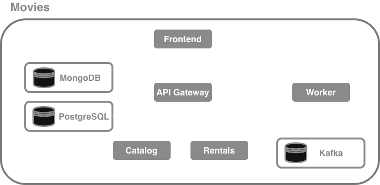

# Okteto Divert Demo - Movies App

## What is Divert?

Okteto's Divert feature allows developers to work on individual microservices without deploying the entire application stack. It uses HTTP header-based routing to intelligently route traffic between shared services and your personal development instances.

**Note**: This demo uses the **Nginx driver with Linkerd** for header-based routing. Okteto Divert also works natively with **Istio** (no Linkerd required). Choose the driver based on your existing service mesh infrastructure.

### Key Benefits

- **Massive Resource Savings**: Deploy only the services you're working on
- **Faster Setup**: Environment ready in seconds instead of waiting for all services to deploy
- **Isolation**: Your changes don't affect other developers
- **Production-like**: Test against real shared services
- **Cost Efficient**: Share expensive infrastructure (databases, message queues)

### How It Works

1. **Shared Namespace**: A complete Movies app stack runs in a shared staging namespace
2. **Personal Namespace**: Your namespace contains only the service(s) you're developing
3. **Smart Routing**: Nginx ingress (with Linkerd sidecar) routes requests with the `baggage: okteto-divert=<your-namespace>` header to your services
4. **Header Propagation**: The baggage header is automatically propagated through all service calls

### Divert Drivers

Okteto Divert supports two drivers:

- **Nginx + Linkerd** (this demo): Uses Nginx ingress controller with Linkerd service mesh for header-based routing
- **Istio** (native): Uses Istio's built-in VirtualService for header-based routing without requiring additional components

To use Istio instead, add `driver: istio` in the divert configurations in the okteto manifest.

## Quick Start

### Prerequisites

- Okteto CLI installed (`brew install okteto` or download from [okteto.com](https://okteto.com))
- kubectl configured
- Access to an Okteto cluster
- Modheader (or a similar extension that enables host header customization) on your browser

### Setup Steps

#### Deploy the Shared Environment

1. **Clone the repository**
   ```bash
   git clone https://github.com/okteto/movies
   cd movies
   ```

2. **Deploy the shared environment**
   ```bash
   okteto preview deploy --repository https://github.com/okteto-community/movies-with-divert --label=okteto-shared movies-shared
   ```

The movies application is composed of five microservices: Frontend, API Gateway, Catalog, Rent, and Worker. Each service is defined in a subfolder. Note that Okteto Divert works independently of the deployment mechanism or architecture. 

This is what the application looks like:



#### Deploy your personal Development Environment

The key advantage of divert is that you only need to deploy the service(s) you are actively working, rather than the full application.

To deploy your development environment export the `OKTETO_SHARED_NAMESPACE` environment variable, and run the `okteto deploy` command with the corresponding okteto manifest. 
```
export OKTETO_SHARED_NAMESPACE="movies-shared"
okteto up -f okteto.catalog.yaml
```

After this, access the application via the endpoint. You'll notice that it still access the shared service. In order for the request to access your personal copy of the catalog service, set the baggage header as shown below, where `cindy` is the name of your personal namespace. We recommend ModHeader for browser-based requests. 

```
baggage: okteto-divert=cindy
```

You can also easily test it from the terminal:

```
# without the header 
> curl -H https://movies-movies-shared.demo.okteto.dev/api/catalog/healthz
Hi from movies-shared!
```


```
curl -H "baggage: okteto-divert=cindy" https://movies-movies-shared.demo.okteto.dev/api/catalog/healthz
Hi from cindy!
```

After setting the host header, hit the application again. Notice how now the request is being automatically routed to your copy of the catalog service. This is the power of Okteto Divert! Get a full end to end experience, while deploying only the services you are actively working on. 

#### Available Divert Configurations:

This repository contains samples for different configurations.

##### 1. Frontend Development (`okteto.frontend.yaml`)
**Use when**: Working on React UI components, user interactions, or frontend features

**What it deploys**:
- Frontend service only (React/Node.js)

**Shares**:
- Catalog service
- API Gateway service
- Rent service
- Worker service

##### 2. Catalog Development (`okteto.catalog.yaml`)
**Use when**: Working on movie catalog, inventory management, or MongoDB integration

**What it deploys**:
- Catalog service only (Node.js/Express)
- MongoDB

**Shares**:
- Frontend
- API service
- Rent service


##### 3. API Gateway Development (`okteto.api.yaml`)
**Use when**: Working on the public API

**What it deploys**:
- API Gateway service only (Golang)

**Shares**:
- Frontend
- Catalog service
- Rent service
- Worker Service

##### 4. Rent Development (`okteto.rent.yaml`)
**Use when**: Working on rental logic, message processing, and Kafka integration

**What it deploys**:
- Rent service only (Java/Spring Boot)
- Worker Service
- Kafka
- PostgresSQL

**Shares**:
- Frontend
- Catalog service
- API service


## Baggage Header Propagation
Note that all the services of the movies app have been instrumented with baggage header propagation. This is so that Okteto Divert routing works seamlessly across all services.


## Best Practices

1. **Use descriptive namespace names**: `<your-name>-movies` or `<feature-name>-movies`
2. **Clean up when done**: Delete personal namespaces after development
   ```bash
   okteto namespace delete alice-movies
   ```
3. **Monitor resource usage**: Check your namespace doesn't exceed quotas
4. **Keep shared staging updated**: Regularly update the shared environment
5. **Use preview environments**: For major changes, consider full preview environments

## Advanced Usage

### Switching to Istio Driver

This demo is configured for **Nginx + Linkerd**. To use **Istio** instead:

1. Edit the divert configuration files (e.g., `okteto-frontend-divert.yaml`)
2. Change the driver:
   ```yaml
   divert:
     namespace: ${SHARED_NAMESPACE:-staging}
     driver: istio  # Changed from 'nginx'
   ```
3. Deploy normally - Istio will handle routing without Linkerd


## Support

- **Documentation**: [okteto.com/docs/divert](https://okteto.com/docs)
- **GitHub Issues**: [github.com/okteto/movies/issues](https://github.com/okteto/movies/issues)
- **Community**: [community.okteto.com](https://community.okteto.com)
- **Slack**: [okteto.com/slack](https://okteto.com/slack)

## License
Apache License 2.0 - See LICENSE file for details